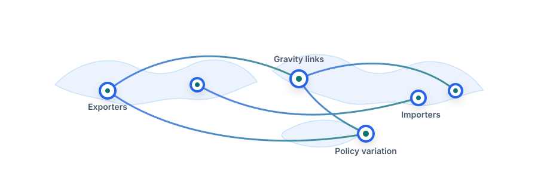

## Applied trade research with gravity models in Python

This graduate course is a replication-based research workshop. Students reproduce a Post-Soviet gravity paper, translate R-style gravity workflows into Python, and develop their own publication-style empirical trade paper.

## Course Anchors

| Anchor | What students do |
|---|---|
| Replication | Reproduce the Post-Soviet gravity workflow |
| Python | Implement OLS, FE OLS, DDM, BVU, PPML, GPML, and structural PPML |
| Data | Work with a 5,253-observation Post-Soviet gravity dataset |
| Research | Adapt the workflow to a new region or policy question |
| Writing | Produce a reproducible notebook and paper draft |

## Workflow

Research question → Data construction → Descriptive analysis → Gravity estimation → Robustness → Paper writing

## Final Outputs

1. Cleaned gravity dataset
2. Python replication notebook
3. Regression and robustness tables
4. Presentation
5. Publication-style paper
